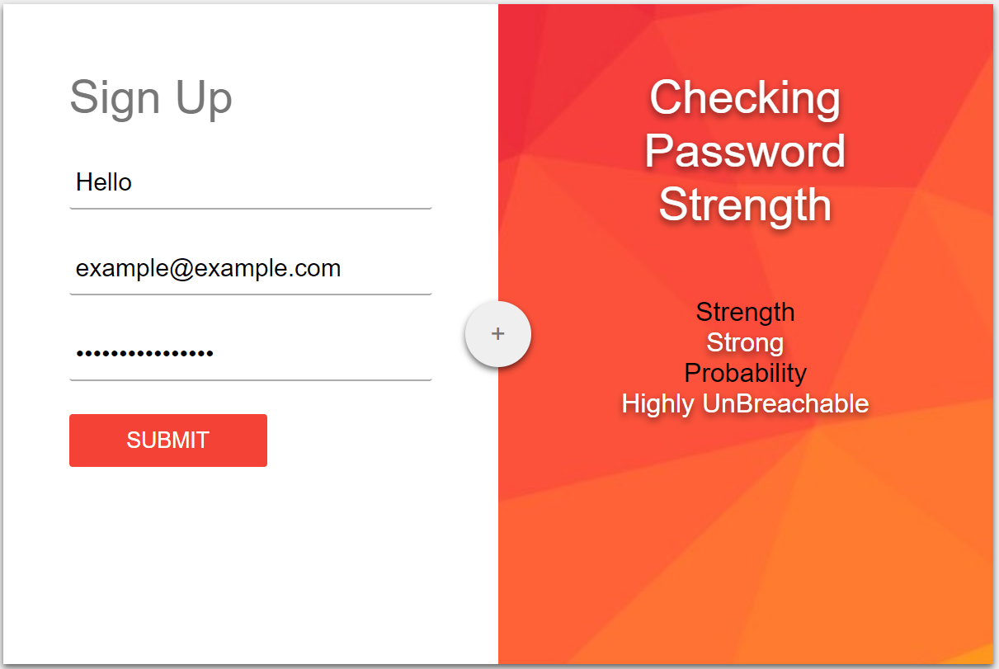
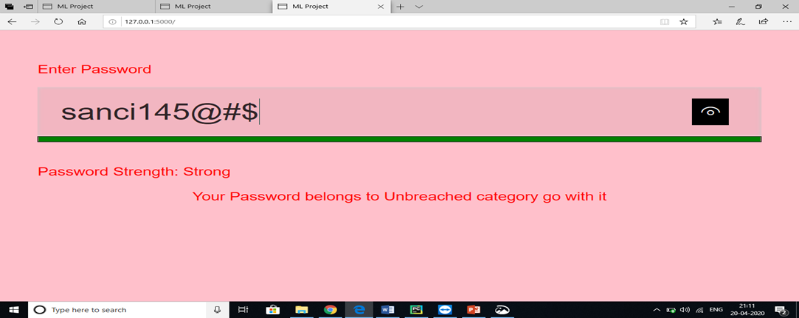

# SmartPass
## A Smarter Approach towards Password Profiling
### Abstract
In today's world of inter-connectivity and vast ocean of services on the Internet, Security seems to be one of the important factor. Passwords have always been the most primitive security and the first line of defense against any unauthorized access. Over the years, with the advancement in computational power and new smarter ways for password-based breaches, passwords need to be stronger than ever.
The determination of Strength of a passwords has always been a topic of discussion for many Security Scientist and experts. The most widely used approach today is the Rule-Based Approach. A password that is able to satisfy a set of rules, such as length, special characters and numbers is considered to be a strong password
### About the Project
In this project we decided to to study the various passwords structures and determine a new way of password profiling using Machine Learning Tools. 
Our objective was to study these passwords and isolate attributes that play an important role in determining the strength of the passwords and use these attributes to profile passwords and determine their strength and Probablity of being Breached.

**FEATURES**
 - A Smarter Way
 - Latest Dataset of Breached Passwords
 - Data-Driven Approach
 - 2 Approaches
	 - Based on Breached Passwords (Clustering)
	 - Based on Breached and UnBreached Passwords (Regression)
 - Real-time Profiling
 - Could be used Individually or as second Layer of ensuring password Strength

|Rule-Based Approach|Smart Approach|
|--|--|
| A set of Regex rules are defined in order to force the user into creating Complex Passwords|There are no fixed Defined Rules
|These Rules are generic in nature |The Rules are auto generated and data dependent
|They increase the probability of Randomness in the password|They leave the creation of the password to the users creativity
|They can be used as guidelines to a malicious attacker|There are no fixed guidelines that impact the creation of the password
|The Rules are fixed and have no scope of updating or scalability in future|The model can be retrained with fresher and more recent data, to generate better results
|The Rules are derived from computational ideal strategies|The Rules are generated on the basis of actual human generated passwords
|Gives Probability of Complexity |Gives Probability of being Breached and Complexity

**Developers**
 - [Agnellus Fernandes ](https://www.linkedin.com/in/agnellus-fernandes-81232b192)
 - [Anisha Fernandes](https://www.linkedin.com/in/anisha-fernandes-9063651a1)
 - [Clarice D'silva](https://www.linkedin.com/in/clarice-dsilva-1689151a7)
-  [Sancia D'cunha](https://www.linkedin.com/in/sancia-dcunha-291a94194)

## Screenshots

1.Clustering Based

***

2.Regression Based

***

**Tools used**  
 - Python 3 (Obviously)
 - Sci-kit Learn Machine Learning Library (Machine Learning Models)
 - Pycharm (IDE of Choice)
 - Flask (Web Based GUI)
 - SecLists (Dataset)
